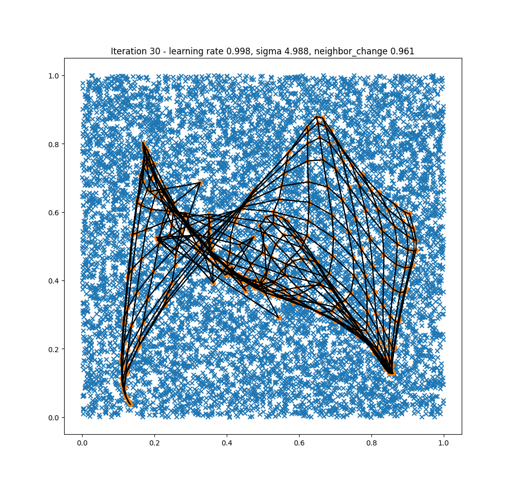
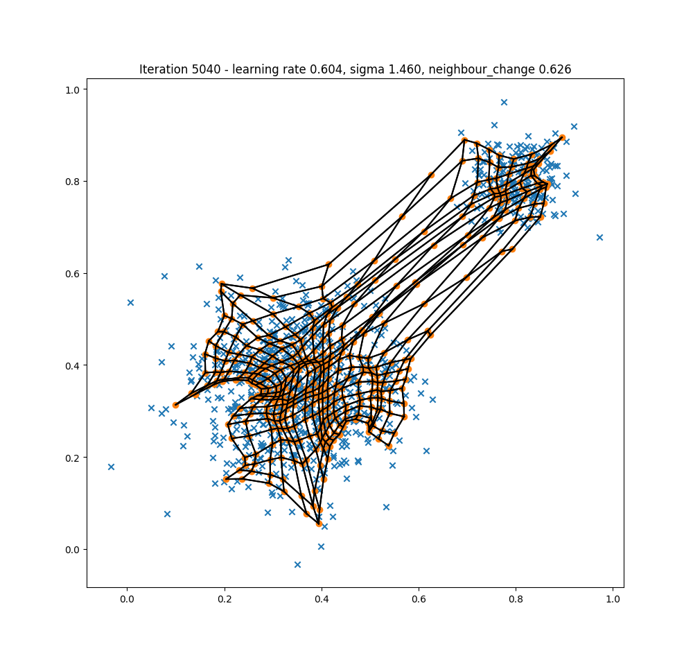

# self-organizing-map
My implementation of self-organizing map (SOM) - https://en.wikipedia.org/wiki/Self-organizing_map

SOM is kind of unsupervised neural network, where neurons are organized in typically two-dimensional space (although it
could be 1 or more dimensions as well). Each neuron has a weight vector (with size equal the input vector). Neurons are
competing among each other for each input, where the winner - best matching unit (bmu) is the neuron closest to the input.
Weights of this bmu are then adjusted - pulled towards the input vector (so they are even closer). The size of this
adjustment is influenced by learning_rate, which is decreasing over time (over iterations). Not just the bmu's
weights are being adjusted, in fact the weights of all neurons are adjusted - pulled towards the input vector. How much are
they adjusted depends on their distance from bmu (distance in the map that is) -> bmu is adjusted the most (its weight vector),
then neurons around it a bit less and so on. The neighborhood is also decreasing with time.

By repeating this process many times the SOM ends up reacting similar to similar inputs - similar looking inputs will
excite the same neurons (or neurons close to each other in the map).

Algorithm:
1. Choose parameters *init_learning_rate*, *learning_rate_constant*, *init_sigma*, *sigma_constant*, *max_iter* - see below what they do
1. Randomly initialise the weight vectors of all neurons
1. Randomly select an input vector
1. Find bmu for the selected input vector - neuron whose weight vector theta is closest to the input vector:
    ```
    argmin(||x - theta||)
    ```
1. Adjust the weight vectors of all neurons, for each neuron
    1. use the neighborhood function *n(bmu_coords, current_neuron_coords, sigma)* to compute how much is it going to be adjusted (the closer to bmu the more):
        ```
        n = exp(-d^2 / sigma^2)
        ```
        where *d* is the distance **in the map** of current neuron from the bmu
        ```
        d = ||bmu_coords - current_neuron_coords||
        ```
        and *sigma()* is a function determining the size of the neighborhood - getting smaller with time by formula:
        ```
        sigma = init_sigma * exp(-it / sigma_constant)
        ```
        where *it* is current iteration and *sigma_constant* is a constant specifying how fast is sigma decreasing
    1. use the result of neighborhood function to adjust the weight vector *theta*:
        ```
        theta = learning_rate() * n(bmu_coords, current_neuron_coords, sigma()) * [x - theta]
        ```
        *learning_rate()* is computed similarly like *sigma* and therefore getting smaller over time:
        ```
        learning_rate = init_learning_rate * exp(-it / learning_rate_constant)
        ```
1. increase the iteration *it*
1. Until *max_iter* is reached, go back to step 3

## Learning visualisation
The easiest way how to visualise the learning is to use coordinates in a plane as the input vectors. Then the weight vectors
of neurons will be adjusted to those inputs, and the network should fit the input space as the weight vector will be
pulled towards the input vectors.

In the following images, the blue points are the inputs - two dimensional vectors. Therefore also weight vectors of neurons are two dimensional - the organe points. The black lines represent connection among neurons in the map - each neuron is connected to its neighbors. The expectation is that during learing the map will strech to cover the input space.

Example with uniformly generated inputs:





Example with inputs generated being concentrated to two areas:





And some other shapes:


# TODOs
1. Make the som show how will the learning_rate and sigma change with current config prior to fitting to make
   configuration easier
1. Stop learning when weights are not adjusted anymore (or just very little)
1. Utility functions to save/load trained SOM